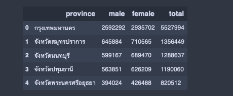
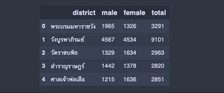

# Thailand Statistic Registration System

Population APIs

```
import pandas as pd
data = population_statistics_province_result
df = pd.DataFrame(data)
df = df.rename(columns={
    "lsccDesc": "province",
    "lssumtotMale": "male",
    "lssumtotFemale": "female",
    "lssumtotTot": "total"
})

df = df[["province", "male", "female", "total"]]
df.head(5)
```



```
  # การแสดง
  # 44 = ผลสำนักทะเบียน/อำเภอ
  # 45 = ตำบล / แขวง
  # 6501 = มกราคม 2565
  # 10 = กรุงเทพ
  # 1001 = เขตพระนคร
  # 100106 = แขวงเสาชิงช้า
data = get_population_statistics_district_view(6501,6512,10,1001)
df = pd.DataFrame(data)
df = df.rename(columns={
    "lsttDesc": "district",
    "lssumtotMale": "male",
    "lssumtotFemale": "female",
    "lssumtotTot": "total"
})

df = df[["district", "male", "female", "total"]]
df.head(5)
```


